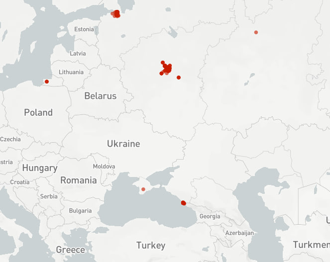
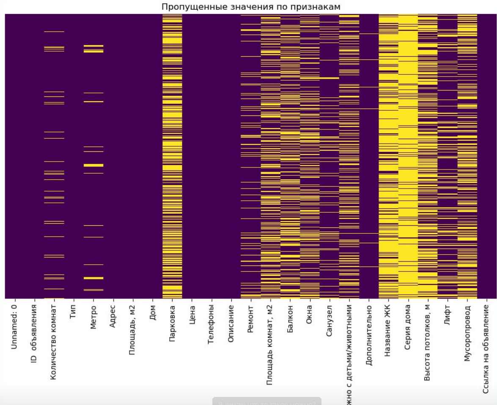
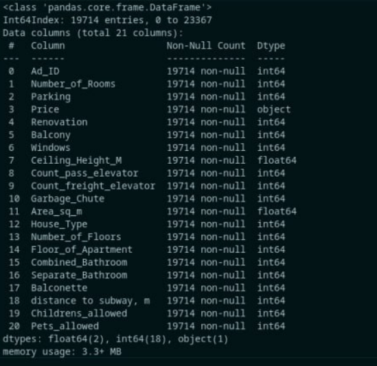

# Data analysis
___
### Анализ и обработка датасета для ML
    Задание phase0 в elbrus bootcamp
**Состав команды:**
* *Алексей*
* *Руслан*
* *Тигран*

В рамках данной задачи необходимо подготовить dataset для обучения нейронной сети на основе  dataset, сформированного на основе более 20 тыс. объявлений об аренде недвижимости на <u>cian.ru</u>
В рамках исследования интерес представляют только *реально существующие* квартиры в г. *Москва*. Обучение будет происходить на отрефакторенном data.csv:
   * Названия колонок строго на английском Snake_Case;
   * Внутри колонок только численные значения, отсутствуют пропуски;
   * Все объявления в датасете уникальны.


Последовательность работы над dataframe (процесс работы над dataset проводился в preprocessing.ipnb):
1) По выборке адресов из предложенного dataset был составлен scattermap, отображающий наличие квартир за пределами Москвы. Для соответствия ТЗ были отброшены все адреса, не содержащие в себе 'Москва'.

2) Была составлена heatmap по заполнению соответствующих колонок. По результатам анализа, было пронято решение удалить колонки с нецелевыми признаками('Unnamed: 0', 'Телефоны', 'Описание', 'Дополнительно', 'Тип', 'Ссылка на объявление'), а также содержащие большое число пропусков - 'Серия дома' и 'Название ЖК'

3) Заполнение пропусков производилось исходя из логических умозаключений сразу и допущений, а также средними, медианными или модальными значениями после определённых операций. Сделаны следующие допущения:

 `*Nan* в колонке 'Ремонт' = 'косметический'`
 `*Nan* в колонке 'Окна' = 'Во двор'`
`*Nan* в колонке 'Лифт' = 'Пасс (1), Груз (1)' если в доме больше 5 этажей, иначе 'Пасс (0), Груз (0)'`
 `*Nan* в колонке 'Мусоропровод' = 'Нет'`
 `*Nan* в колонке 'Балкон' = 'Балкон (0), Лоджия (0)'`
`*Nan* в колонке 'Парковка' = 'Наземная'`
`*Nan* в колонке 'Санузел' = 'Совмещённый (1)'`
`*Nan* в колонке 'Можно с детьми/животными' = 'по договорённости'`
4) Время до метро из колонки 'Метро' было преобразовано в расстояние до метро из расчёта одна минута пешком = 70м, одна минута на машине = 750 м.
5) Из колонки 'Описание' извлекаем цену в рублях с конвертацией по курсу (1 долл. = 95 руб., 1 евро = 100 руб.). Отдельно создаём колонку 'Залог', куда по слову "залог" отправляем величину залога в рублях, либо 0 при отсутствии ключевого слова. 
7) Проверка на наличие пропусков в таблице:
``nans = df.isna().any().any()`` 
8) Все колонки переименовываем на английский
9) Последующая работа заключается в преобразовании dataframe под требования ТЗ. Для этого создаём копию dataframe 
``df_encode = df.copy()``.
Тип object для вещественных признаков меняется на int/float. Категориальные признаки кодируются при помощи LabelEncode библиотеки skit-learn. 
```df_encode.info()```:

8) Так как нас интересуют только реальные объекты в г. Москва - отбрасываем различные выбросы путём создания интервалов и пределов некоторых величин, таких как минимальная-максимальная высота потолка, минимальная цена аренды, максимальная этажность здания, минимальная площадь жилого помещения:

``df_encode = df_encode[df_encode['Number_of_Floors'] <= 95]``

``df_encode = df_encode[df_encode['Area_sq_m'] >= 8]``

``df_encode = df_encode[df_encode['Ceiling_Height_M'] >= 2.2]``

``df_encode = df_encode[df_encode['Ceiling_Height_M'] <= 8]``

``df_encode = df_encode[df_encode['Price'] >= 12000]``

Итоговый объём dataframe составил: 19714 срок


